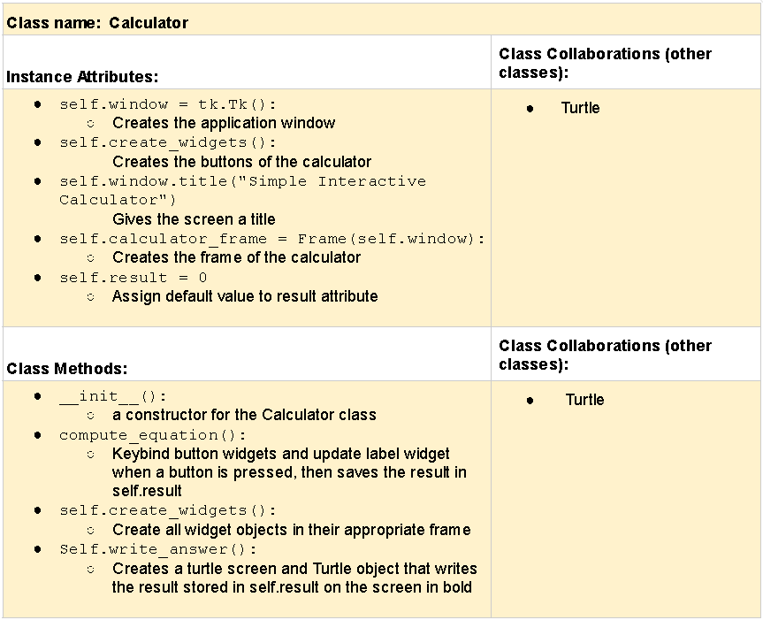

# CSC226 Final Project

**Author(s)**: Tafreed Sardar, Hope Michael

**Google Doc Link**: https://docs.google.com/document/d/1UKZfv3geGkOdmvUdQ1jIEGk3vvioOPGFC-actVCHqDw/edit?usp=sharing

---

## Milestone 1: Setup, Planning, Design

**Title**: `Interactive Calculator with Turtle`

**Purpose**: `Building an interactive calculator and using a turtle object to write the result.`

**Source Assignment(s)**: `RQ18: Chapter 15: Event Driven Programming and GUIs`

**CRC Card(s)**:
  


**Branches**:  

```
    Branch 1 starting name: sardart
    Branch 2 starting name: michaelh2
```

### References 

Julio Jijon

---

## Milestone 2: Code Setup and Issue Queue

Most importantly, keep your issue queue up to date, and focus on your code. 🙃

Reflect on what you’ve done so far. How’s it going? Are you feeling behind/ahead? What are you worried about? 
What has surprised you so far? Describe your general feelings. Be honest with yourself; this section is for you, not me.

```
    **Replace this text with your reflection
```

---

## Milestone 3: Virtual Check-In

Indicate what percentage of the project you have left to complete and how confident you feel. 

❗️**Completion Percentage**: `0 - 100%`

❗️**Confidence**: Describe how confident you feel about completing this project, and why. Then, describe some 
  strategies you can employ to increase the likelihood that you'll be successful in completing this project 
  before the deadline.

```
    **Replace this text with your reflection
```

---

## Milestone 4: Final Code, Presentation, Demo

### ❗User Instructions

In a paragraph, explain how to use your program. Assume the user is starting just after they hit the "Run" button 
in PyCharm. 

### ❗Errors and Constraints

Every program has bugs or features that had to be scrapped for time. These bugs should be tracked in the issue queue. 
You should already have a few items in here from the prior weeks. Create a new issue for any undocumented errors and 
deficiencies that remain in your code. Bugs found that aren't acknowledged in the queue will be penalized.

### ❗Peer Evaluation

It is important that all members of your team contribute equitably. The peer evaluation is your chance to either 
a) celebrate the great work you all did together as an effective team, or b) indicate to the instructor if a member of
your team did not contribute their fair share. Grades will be adjusted for any team member who is evaluated poorly. Your
commit history will be used as evidence, so make sure you are using git effectively!

### ❗Reflection

Each partner should write three to four well-written paragraphs address the following (at a minimum):
- Why did you select the project that you did?
- How closely did your final project reflect your initial design?
- What did you learn from this process?
- What was the hardest part of the final project?
- What would you do differently next time, knowing what you know now?
- How well did you work with your partner? What made it go well? What made it challenging?

```
    Partner 1: **Replace this text with your reflection
```

```
    Partner 2: **Replace this text with your reflection
```

---