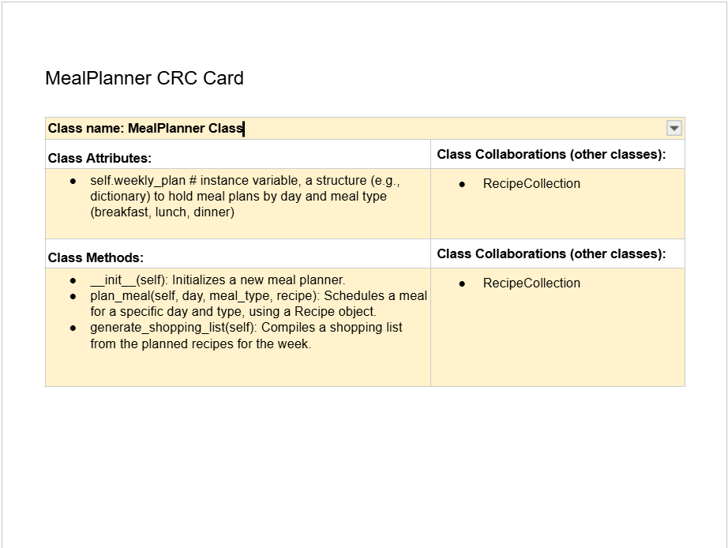
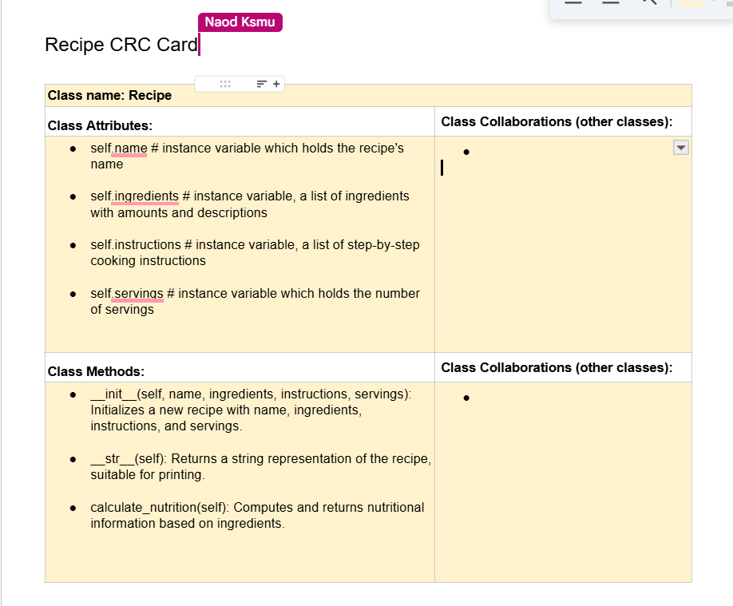
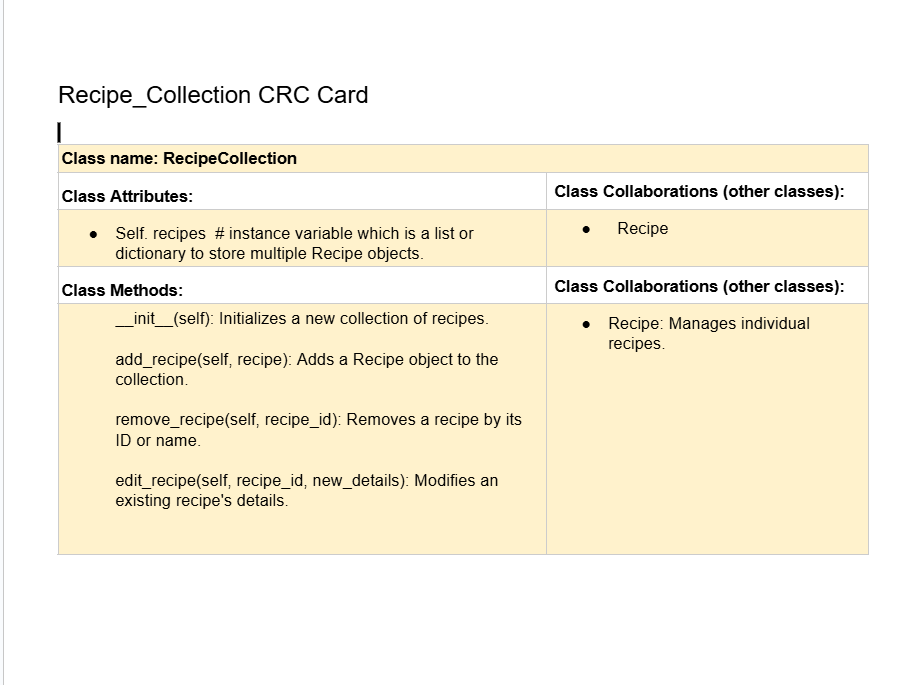
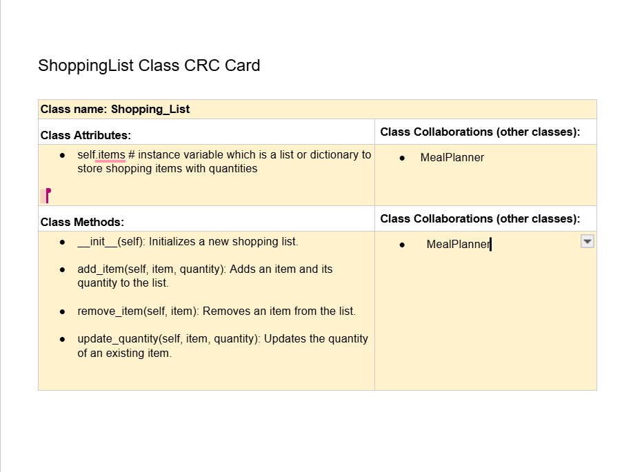

# ❗CSC226 Final Project

## Instructions

❗️Exclamation Marks ❗️indicate action items; you should remove these emoji as you complete/update the items which 
  they accompany. (This means that your final README should have no ❗️in it!)

❗️**Author(s)**: Kamau Clark, Naod Ksmu

❗️**Google Doc Link**: https://docs.google.com/document/d/13EO7nWam9933nf8DoYmTe1gZ321sO48OcgQAgKhBpjs/edit?usp=sharing

---

## Milestone 1: Setup, Planning, Design

❗️**Title**: `Food Companion`

❗**Purpose**: `Food Companion helps users efficiently manage their recipes, plan weekly meals, and generate shopping lists based on selected meals, simplifying meal preparation and grocery shopping.`

❗️**Source Assignment(s)**: `
Source Assignment(s)

This application is a smart, interactive recipe manager and meal planner. It allows users to:

- Add and view recipes with detailed ingredients and instructions
- Automatically calculate the calorie content for any recipe
- Use Smart AI to get recipe suggestions based on available ingredients
- Plan meals for specific days and meal types (breakfast, lunch, dinner)
- View a full weekly meal plan, including estimated daily calorie totals
- Browse recipe cards visually using integrated images (JPG or PNG)

The project uses Python's object-oriented features (classes and inheritance), JSON file handling, and Tkinter for the graphical user interface. It was heavily inspired by the *EventGuru* concept from Teamwork2 (T12: Events and GUIs), and built out into a full working application with all features integrated.

❗️**CRC Card(s)**:
  - Create a CRC card for each class that your project will implement.
  - See this link for a sample CRC card and a template to use for your own cards (you will have to make a copy to edit):
    [CRC Card Example](https://docs.google.com/document/d/1JE_3Qmytk_JGztRqkPXWACJwciPH61VCx3idIlBCVFY/edit?usp=sharing)
  - Tables in markdown are not easy, so we suggest saving your CRC card as an image and including the image(s) in the 
    README. You can do this by saving an image in the repository and linking to it. See the sample CRC card below - 
    and REPLACE it with your own:
  
markdown_content = """




"""
( "Image of CRC card as an example. Upload your CRC card(s) in place of this one. ")


❗️**Branches**: This project will **require** effective use of git. 

Each partner should create a branch at the beginning of the project, and stay on this branch (or branches of their 
branch) as they work. When you need to bring each others branches together, do so by merging each other's branches 
into your own, following the process we've discussed in previous assignments, then re-branching out from the merged code.  

```
    Branch 1 starting name: Clarkk2
    Branch 2 starting name: Ksmu2312
```

### References 

Throughout this project, you will likely use outside resources. Reference all ideas which are not your own, 
and describe how you integrated the ideas or code into your program. This includes online sources, people who have 
helped you, AI tools you've used, and any other resources that are not solely your own contribution. Update this 
section as you go. DO NOT forget about it!

---

## Milestone 2: Code Setup and Issue Queue

Most importantly, keep your issue queue up to date, and focus on your code. 🙃

Reflect on what you’ve done so far. How’s it going? Are you feeling behind/ahead? What are you worried about? 
What has surprised you so far? Describe your general feelings. Be honest with yourself; this section is for you, not me.

```
    **So far, things are going pretty well. At first, I felt a little behind just because there were a lot of moving parts to manage — recipes, calories, AI, planning meals ;
     but once I locked in and started organizing my files and logic, everything came together.
     The class structure made things cleaner than I expected, and seeing everything connect, especially with the new GUI, made it more rewarding.
     What surprised me most is how deep a simple recipe app can get when you start adding smart features like AI suggestions or visual elements. I’m proud of how the app is starting to feel like a real product.
      My only worry is making sure the visuals and experience are as good as the logic underneath.
```

---

## Milestone 3: Virtual Check-In

Indicate what percentage of the project you have left to complete and how confident you feel. 

❗️**Completion Percentage**: `90%`

❗️**Confidence**: Describe how confident you feel about completing this project, and why. Then, describe some 
  strategies you can employ to increase the likelihood that you'll be successful in completing this project 
  before the deadline.

```
    **The core features are fully implemented ; including recipe tracking, calorie calculation, meal planning, and smart AI ingredient suggestions.
     The new GUI gives everything a better look, and I even added recipe images and a logo to bring it to life.
    To stay on track, I’m going to make sure all image files and dependencies are bundled cleanly and check that everything runs smoothly on different systems.
```

---

## Milestone 4: Final Code, Presentation, Demo

### ❗User Instructions

In a paragraph, explain how to use your program. Assume the user is starting just after they hit the "Run" button 
in PyCharm. 

### ❗Errors and Constraints

Every program has bugs or features that had to be scrapped for time. These bugs should be tracked in the issue queue. 
You should already have a few items in here from the prior weeks. Create a new issue for any undocumented errors and 
deficiencies that remain in your code. Bugs found that aren't acknowledged in the queue will be penalized.

### ❗Peer Evaluation

It is important that all members of your team contribute equitably. The peer evaluation is your chance to either 
a) celebrate the great work you all did together as an effective team, or b) indicate to the instructor if a member of
your team did not contribute their fair share. Grades will be adjusted for any team member who is evaluated poorly. Your
commit history will be used as evidence, so make sure you are using git effectively!

### ❗Reflection

Each partner should write three to four well-written paragraphs address the following (at a minimum):
- Why did you select the project that you did?
- How closely did your final project reflect your initial design?
- What did you learn from this process?
- What was the hardest part of the final project?
- What would you do differently next time, knowing what you know now?
- How well did you work with your partner? What made it go well? What made it challenging?

```
    Partner 1: **Replace this text with your reflection
```

```
    Partner 2: **Replace this text with your reflection
```

---