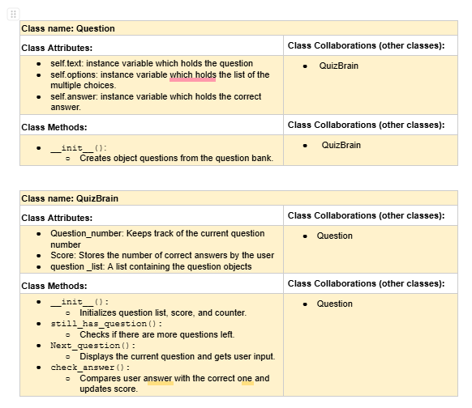
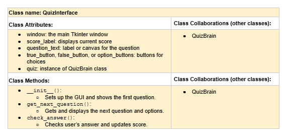

# CSC226 Final Project

## Instructions

Exclamation Marks ❗️indicate action items; you should remove these emoji as you complete/update the items which 
  they accompany. (This means that your final README should have no ❗️in it!)

**Author(s)**: Bao Hoang, Ahna Watt

**Google Doc Link**: https://docs.google.com/document/d/1xhwgIZ77x40PH8CmxLtbfy5zquaHJfla-Vw4kSF16CM/edit?tab=t.0

---

## Milestone 1: Setup, Planning, Design

**Title**: `The Quiz of Ultimate Knowledge`

**Purpose**: `We will create a quiz where the user can answer questions on any given category, and it’ll track the scores of how many they got right and wrong.`

**Source Assignment(s)**: `We are not using any other assignments as sources.`

**CRC Card(s)**:
  - Create a CRC card for each class that your project will implement.
  - See this link for a sample CRC card and a template to use for your own cards (you will have to make a copy to edit):
    [CRC Card Example](https://docs.google.com/document/d/1JE_3Qmytk_JGztRqkPXWACJwciPH61VCx3idIlBCVFY/edit?usp=sharing)
  - Tables in markdown are not easy, so we suggest saving your CRC card as an image and including the image(s) in the 
    README. You can do this by saving an image in the repository and linking to it. See the sample CRC card below - 
    and REPLACE it with your own:
  
  


**Branches**: This project will **require** effective use of git. 

Each partner should create a branch at the beginning of the project, and stay on this branch (or branches of their 
branch) as they work. When you need to bring each others branches together, do so by merging each other's branches 
into your own, following the process we've discussed in previous assignments, then re-branching out from the merged code.  

```
    Branch 1 starting name: hoangb
    Branch 2 starting name: watta
```

### References 

Throughout this project, you will likely use outside resources. Reference all ideas which are not your own, 
and describe how you integrated the ideas or code into your program. This includes online sources, people who have 
helped you, AI tools you've used, and any other resources that are not solely your own contribution. Update this 
section as you go. DO NOT forget about it!

    https://www.geeksforgeeks.org/how-to-clear-out-a-frame-in-the-tkinter/
    https://opentdb.com/
    https://www.geeksforgeeks.org/python-mcq-quiz-game-using-tkinter/
    ctypes.windll.shcore.SetProcessDpiAwareness(1) (got it from chatGPT)
    activebackground="white", activeforeground="black", disabledforeground="black" (got it from chatGPT)
---

## Milestone 2: Code Setup and Issue Queue

Most importantly, keep your issue queue up to date, and focus on your code. 🙃

Reflect on what you’ve done so far. How’s it going? Are you feeling behind/ahead? What are you worried about? 
What has surprised you so far? Describe your general feelings. Be honest with yourself; this section is for you, not me.

```
    It's going well. We're making good progress. 
    Ahna: I think it's going well. I'm learning a lot from Bao, though there's still a lot for me to learn. What surprised 
    me was how much easier certain lines of code can be when you break things down step by step.
    Bao: It's going pretty well. I work well with Ahna, and he's a good teammate. I'm surprised by how powerful the open 
    database is. I can use it to play unlimited time with different choices of levels and so on.
```
    
---

## Milestone 3: Virtual Check-In

Indicate what percentage of the project you have left to complete and how confident you feel. 

️**Completion Percentage**: `100% - 100%`

**Confidence**: Describe how confident you feel about completing this project, and why. Then, describe some 
  strategies you can employ to increase the likelihood that you'll be successful in completing this project 
  before the deadline.

```
    We managed to finish the project on time. Bao and I were meeting weekly to work on the project and we were communicating 
    often if a time we had picked still worked on not. 
```

---

## Milestone 4: Final Code, Presentation, Demo

### ❗User Instructions

In a paragraph, explain how to use your program. Assume the user is starting just after they hit the "Run" button 
in PyCharm. 

### ❗Errors and Constraints

Every program has bugs or features that had to be scrapped for time. These bugs should be tracked in the issue queue. 
You should already have a few items in here from the prior weeks. Create a new issue for any undocumented errors and 
deficiencies that remain in your code. Bugs found that aren't acknowledged in the queue will be penalized.

### ❗Peer Evaluation

It is important that all members of your team contribute equitably. The peer evaluation is your chance to either 
a) celebrate the great work you all did together as an effective team, or b) indicate to the instructor if a member of
your team did not contribute their fair share. Grades will be adjusted for any team member who is evaluated poorly. Your
commit history will be used as evidence, so make sure you are using git effectively!

### ❗Reflection

Each partner should write three to four well-written paragraphs address the following (at a minimum):
- Why did you select the project that you did?
- How closely did your final project reflect your initial design?
- What did you learn from this process?
- What was the hardest part of the final project?
- What would you do differently next time, knowing what you know now?
- How well did you work with your partner? What made it go well? What made it challenging?

```
    Partner 1: We chose this project because Bao came up with it and I liked it. It was a good idea that didn't seem crazy 
    hard and doable in the amount of time that we had. I think for the most part, we did everything that we had designed in
    the CRC card. The only difference, which wasn't major, was that we didn't end up using the title that we initially thought 
    up in the beginning. 
    I learned a lot from this project. I better understood codes, what they do, and leared a lot more functions and operations. 
    The hardest part was, undoutebdly, the coding part, and putting our ideas into practice. Through the whole process, there
    were a lot of things that seemed to mess up, as well as tiny errors that were annoying to debug. I remember trying to 
    set the background color to the color that we had picked and I forgot to add the "#" before it and was figuring out why it 
    didn't work. Also, when trying to increment the score, I had "=+" instead of "+=". 
    I don't know if I would do anything different. What me and Bao had seemed to work pretty well and we managed to finish 
    the project on time. To add on, we worked pretty well together. Bao is a much better programmer than I am, so I asked 
    a lot of questions, and she was more than willing to answer them and was very patient. She taught me a whole lot during 
    this this time we worked together. Dr. Heggen did mention this to me, but what made it kind of challenging was that sometimes 
    we'll be working on it and I'd be really stuck and I'll have to keep asking Bao questions and for help, and I, sometimes, felt like 
    I was holding her back and having imposter syndrome because I was like "Wow she's so smart, and I'm no where near the level
    she is." In the end, though, we managed to make it work and finished the project, which was very reliving and lifted 
    a huge weight and stress off my shoulders. 
        
```

```
    Partner 2: **Replace this text with your reflection
```

---